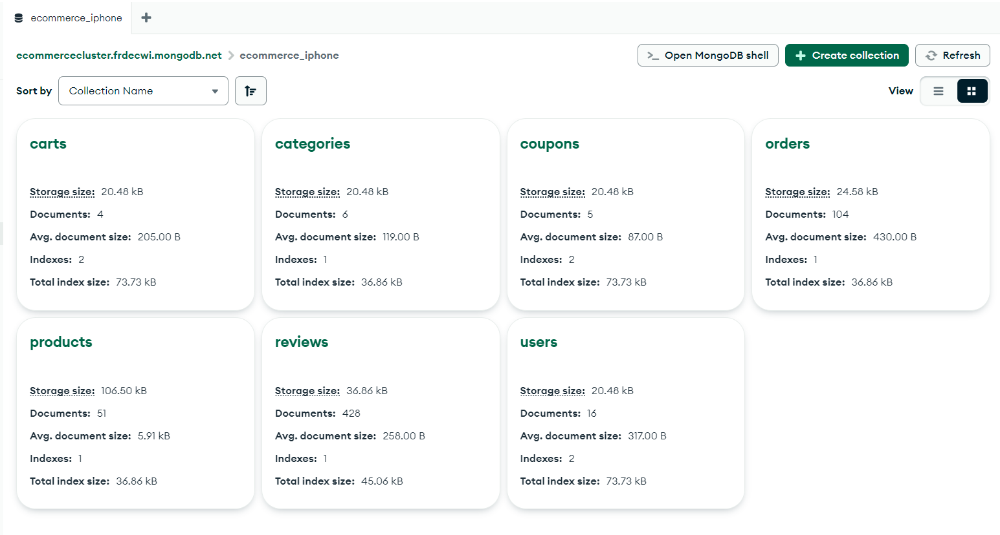

# iphones-store-nodejs-express-mongodb-react

# iPhones Store - MERN Stack (Node.js + Express + MongoDB + React)

A full-stack e-commerce website for selling iPhones, built with the **MERN stack** (MongoDB, Express.js, React, Node.js).  
This project includes both the **Admin Dashboard** and the **Client Shopping Interface**, along with **RESTful APIs**, **Mongoose-based data modeling**, **JWT authentication**, **Momo payment integration**, and **Sales statistics**.

## 🚀 Features

### 👤 Admin
- Quản lý sản phẩm và biến thể (color, storage[64, 128, 256, 512GB], price)
- Quản lý danh mục sản phẩm
- Quản lý đơn hàng và cập nhật trạng thái
- Tạo và quản lý mã giảm giá
- Quản lý người dùng
- Thống kê doanh thu theo thời gian

### 🛍️ Client
- Giao diện trang chủ hiện đại
- Xem chi tiết sản phẩm
- Thêm sản phẩm vào giỏ hàng
- Tạo đơn hàng và thanh toán (COD / Momo)
- Theo dõi trạng thái đơn hàng

---

## 🖼️ Demo Screenshots

### Admin Dashboard

| Tên ảnh | Xem trước |
|--------|-----------|
| Danh mục |  |
| Đơn hàng |  |
| Mã giảm giá |  |
| Sản phẩm |  |
| Thêm biến thể sản phẩm |  |
| Thống kê doanh thu |  |
| Người dùng |  |

### Client Website

| Tên ảnh | Xem trước |
|--------|-----------|
| Landing Page |  |
| Trang sản phẩm |  |
| Giỏ hàng |  |
| Chi tiết đơn hàng |  |
| Thanh toán đơn hàng |  |
| Thanh toán MoMo |  |

### MongoDB (Database)

| Tên ảnh | Xem trước |
|--------|-----------|
| Products Collection |  |
| MongoDB Overview |  |

---

## 📦 Tech Stack

- **Frontend**: ReactJS, Boostrap5, Axios, React Router DOM
- **Backend**: Node.js, Express.js, REST API
- **Database**: MongoDB, Mongoose, Atlas
- **Authentication**: JWT, Role-based access
- **Payment Integration**: Momo API
- **UI Framework**: TailwindCSS / Bootstrap (tùy cấu hình)

---
